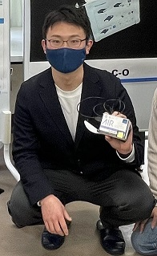

* content
{:toc}

## At school

A student.
I am studying at NITAC Advanced Course Department of Mechanical and Electronic System Engineering.
 
I am supposed to get on bachelor degree of electrical and electronic engineering.
 
I had been researched **Remote Driving System Usability**,
and **Human Machine Interface of Cars by using RC car**.
 
In the future, we plan to develop an autonomous driving system for radio-controlled cars, which will be operated by switching between autonomous and manual driving, and conduct research on problems that arise when taking over driving.

## Hobbys
I've been playing some sports. 
🥋 Judo: for 9 years (also have black belt) 
⚾ Baseball: for 6 years 
🤾 Handball: for a year 
(I like baseball the most.)
 
I like reading manga, playing Lego and excercising at gyms.

## Contact

* GitHub：[meijinn](https://github.com/meijinn)
* email：sharo.e1621@gmail.com
* [Facebook](https://www.facebook.com/takahashi2001)
* [Twitter](https://www.twitter.com/nitac_dd)

## External link

[NITAC](https://www.akashi.ac.jp/english/) \| [Electrical Engineering](https://en.wikipedia.org/wiki/Electrical_engineering) \| [Electronic Engineering](https://en.wikipedia.org/wiki/Electronic_engineering) \| [Circuit Simulator](http://www.falstad.com/circuit/) \| [tinkercad](https://www.tinkercad.com/) \| [Arduino](https://www.arduino.cc) \| [Processing](https://processing.org/) \| [studio 2.0](https://www.bricklink.com/v3/studio/download.page)

## Comments


